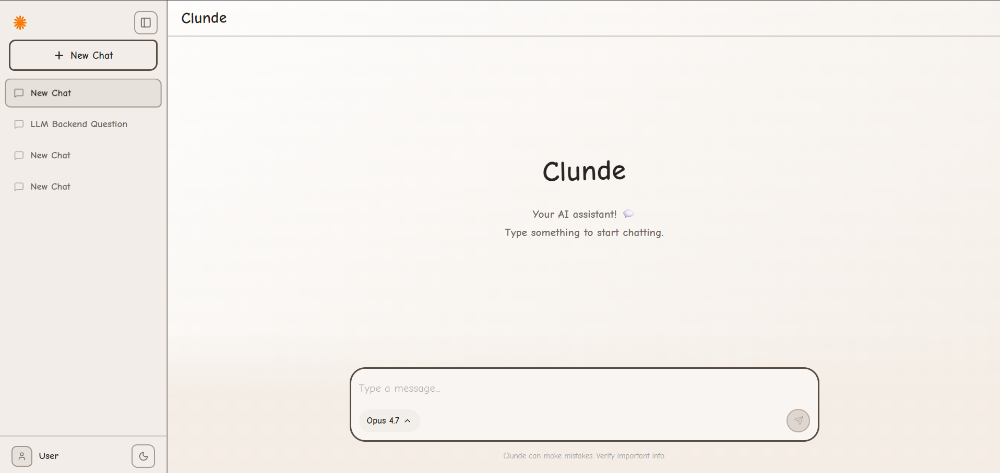
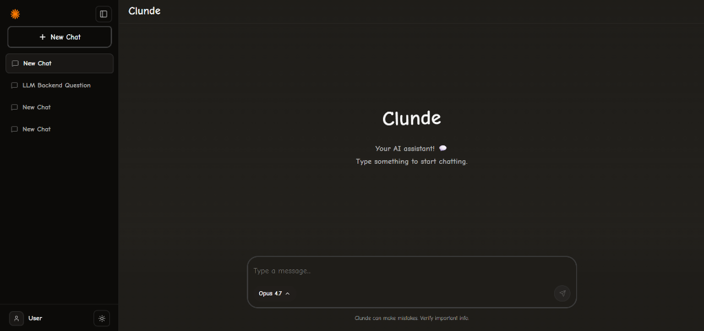
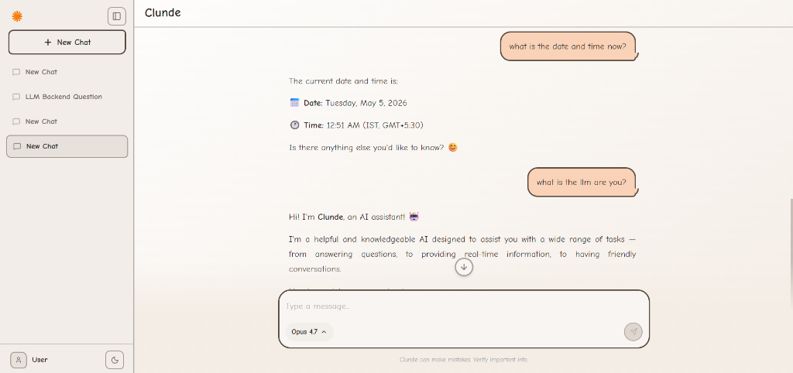
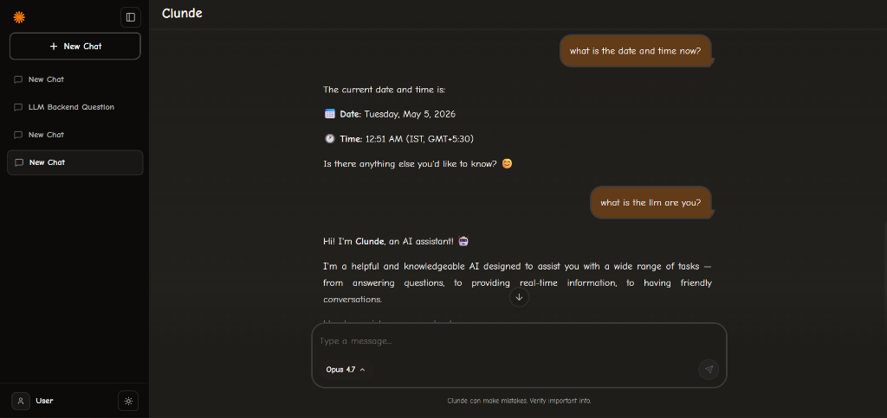

# Clunde AI 🤖

Clunde is a full-featured, AI-powered chatbot interface built with a unique drawn aesthetic. It leverages the free `puter.js` API to provide access to multiple powerful Large Language Models (LLMs) in a single unified interface.

## Features ✨

* **Multi-LLM Access:** Seamlessly switch between top-tier models (Claude Opus, GPT-5 Pro mockups, Gemini Pro, Mistral, etc.) natively powered by the Puter.js AI API.
* **Interactive UI:** A highly polished, responsive aesthetic complete with a light/dark mode theme engine, typing indicators, and smooth animations.
* **Real-time Web Searching:** Integrates `duck-duck-scrape` to dynamically fetch current internet data to answer real-time queries.
* **Persistent Storage:** Fully integrated with MongoDB to store user chats, history, and long-term memory.
* **Smart Memory System:** Implements RAG (Retrieval-Augmented Generation) and conversation summarization to maintain long-term context across lengthy chats.
* **Markdown Support:** Renders rich text, code blocks (with syntax highlighting), and tables perfectly.

## Prerequisites 📋

Before you begin, ensure you have the following installed on your machine:
* **Node.js** (v16.0 or higher)
* **MongoDB** (Local instance or MongoDB Atlas URI)
* A valid **Puter.js Auth Token**

## Folder Structure 📂

The project is structured as a full-stack monolith containing both the React frontend and Express backend:

```text
claude_clone/
├── backend/                  # Express.js API Server
│   ├── controllers/          # Route logic (chats, messages)
│   ├── models/               # MongoDB Schemas (Chat, Message, Memory)
│   ├── services/             # Core logic (Puter AI service, Memory Manager)
│   ├── server.js             # Main backend entry point
│   ├── .env                  # Environment variables
│   └── package.json          # Backend dependencies
└── frontend/                 # React.js Vite Application
    ├── public/               # Static assets (Clunde SVG icons)
    ├── src/                  # React source code
    │   ├── App.jsx           # Main UI Interface
    │   ├── api.js            # Axios client for backend communication
    │   └── index.css         # Tailwind directives & global styling
    ├── tailwind.config.js    # Tailwind theme configuration
    └── package.json          # Frontend dependencies
```

## Environment Variables (.env) 🔐

Create a `.env` file in the `backend/` directory and configure the following variables:

```env
PORT=5000
MONGODB_URI=mongodb://127.0.0.1:27017/clunde_db
PUTER_AUTH_TOKEN=your_puter_auth_token_here
```

## Setup Steps 🚀

Follow these steps to get the project running locally:

**1. Clone the repository and navigate into the project:**
```bash
cd claude_clone
```

**2. Install Backend Dependencies & Start Server:**
```bash
cd backend
npm install
npm run dev
```

**3. Install Frontend Dependencies & Start Application:**
Open a new terminal window:
```bash
cd frontend
npm install
npm run dev
```

**4. Open your browser:**
Navigate to `http://localhost:5173` to start chatting with Clunde!

## Screenshots 📸

<p align="center">
  
  
</p>
<p align="center">
  
  
</p>

## Puter.js API Structure & Token Limitations ⚙️

**How it works:**
The core AI orchestration is handled in `backend/services/ai.service.js`. We initialize the Puter client using your `PUTER_AUTH_TOKEN`. When a user sends a message, the `message.controller.js` compiles the recent chat history, RAG summaries, and real-time data, and passes it to the `ai.service.js`. 

The backend invokes `puter.ai.chat(messages, { stream: true, model: selectedModel })`. Puter acts as a proxy, securely routing the request to the underlying LLM provider (OpenAI, Anthropic, Google, etc.) and returning a Server-Sent Event (SSE) stream back to our React frontend.

**Usage Limits:**
Puter.js provides incredible free access to premium models, but it operates on a quota system based on user accounts. If you send too many requests in a short period, or exhaust the daily token limit for premium models (like Claude 3 Opus or GPT-4o), the API will return a rate-limit error. The Clunde backend is designed to gracefully catch these errors and notify you in the chat interface.

## Conclusion 🎉

Clunde AI is designed to be a lightweight, visually striking, and highly capable AI assistant that proves how powerful free-tier APIs like Puter.js can be when paired with a solid memory management system and a beautiful frontend. Enjoy chatting!
